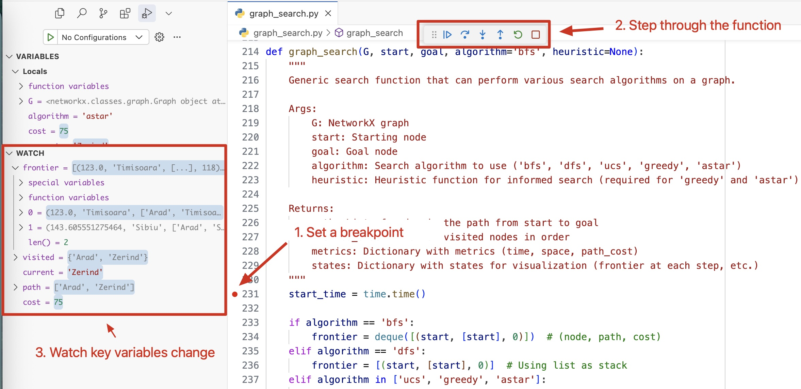

# Search Algorithms Playground for CS3600

This repository provides an interactive playground for exploring search algorithms as part of the CS3600 (Introduction to Artificial Intelligence) course at Georgia Tech. It contains implementations of various search strategies applied to classic AI problems.

Below is a demo of the interactive search visualization showing A Star and Greedy Best-First Search on the Romania map:


## Overview

### Problems and Games

This repository includes implementations of three classic search problems:

1. **Graph Search**: A general implementation of search algorithms on weighted graphs, including the Romania road map example from the AIMA textbook.

2. **Word Ladder**: A word game where you transform one word into another by changing one letter at a time, with each intermediate step being a valid word (e.g., "cat" → "cot" → "dot" → "dog").

3. **N-Puzzle**: The classic sliding tile puzzle (8-puzzle, 15-puzzle, etc.) where you need to rearrange numbered tiles to reach a goal configuration.

### Implemented Algorithms

The repository includes both uninformed and informed search strategies:

- **Uninformed Search**:
  - Breadth-First Search (BFS)
  - Depth-First Search (DFS)
  - Uniform-Cost Search (UCS)

- **Informed Search**:
  - Greedy Best-First Search
  - A* Search

### Heuristics

For informed search algorithms, several heuristics are implemented:

- **For Graph Search**:
  - Euclidean distance
  - Manhattan distance

- **For Word Ladder**:
  - Hamming distance (number of differing letters)
  - Letter set difference
  - Vowel-consonant difference (intentionally poor heuristic for comparison)

- **For N-Puzzle**:
  - Manhattan distance
  - Misplaced tiles
  - Linear conflict

## How to Use This Repository

There are three ways to use this code:

### 1. Using Google Colab (Recommended for Quick Start)

The easiest way to use this code is to use this [Google Colab](https://colab.research.google.com/drive/1D_T4jbBuHpuIavGqY6hK7SZBUou8PuL3?usp=sharing) that replicates the functionality in `search_strategies.ipynb` notebook. The Colab notebook is a good way to get started with the code and explore the algorithms.


### 2. Local Setup

To run the code locally:

1. Clone this repository:
   ```bash
   git clone https://github.com/karpekov/cs3600-search.git
   ```

2. Set up the environment:

   **Using Conda (Recommended)**:
   ```bash
   conda env create -f environment.yml
   conda activate cs3600-search
   ```

   **Using pip**:
   ```bash
   pip install numpy pandas matplotlib networkx ipywidgets jupyter notebook altair
   ```

3. Launch Jupyter Notebook:
   ```bash
   jupyter notebook
   ```

4. Open `search_strategies.ipynb` to explore the interactive demonstrations.

### 3. Local Setup with Debugging

For a deeper understanding of the algorithms, you can debug the code using an IDE like VSCode:

1. Follow the local setup steps above
2. Open the repository in VSCode with the Python extension installed
3. Set breakpoints in key locations (see Debugging section below)
4. Run the Python files directly to observe algorithm execution step by step

## Files Description

- `search_strategies.ipynb`: Main notebook with examples and interactive demonstrations
- `graph_search.py`: Implementation of graph search algorithms
- `n_puzzle.py`: Implementation of the n-puzzle problem
- `word_ladder.py`: Implementation of the Word Ladder game

## Debugging the Algorithms

Debugging code is an excellent way to understand the algorithms and their implementation details. This guide will help you set up breakpoints directly in the main files to observe how the algorithms work step by step.

### Setting Up a Debug Environment

#### Using VSCode (Recommended)

1. Open the project folder in VSCode
2. Install the Python extension if you haven't already
3. Go to the Debug tab (or press `Ctrl+Shift+D` / `Cmd+Shift+D`)
4. Create a `launch.json` file if it doesn't exist yet, with a Python configuration

Read more about setting up a debug environment in VSCode [here](https://code.visualstudio.com/docs/debugtest/debugging).

### Debugging graph_search.py



1. Open `graph_search.py` in your editor
2. Scroll to the end of the file where the `if __name__ == "__main__":` section is
3. This section already has example code that runs the algorithm on the Romania map
4. Set breakpoints at key points in the `graph_search` function:
   - Line ~210: At the beginning of the function to observe initialization
   - Line ~270: Inside the main `while frontier:` loop to see each iteration
   - Line ~290: Where neighbors are processed and added to the frontier
   - Line ~240: Where the goal is found and the path is returne
5. Run the file in debug mode:
   - In VSCode: Press F5 or click the green play button in the Debug tab
   - This will execute the code in `if __name__ == "__main__":` section and hit your breakpoints

### Key Variables to Watch

When debugging these algorithms, pay attention to these important variables:

#### In graph_search.py:
- `frontier`: This shows the nodes to be explored next (queue, stack, or priority queue)
- `visited`: The set of nodes already explored
- `current`: The node being processed in the current iteration
- `path`: The current path being built
- `cost`: The cost of the path so far

#### In n_puzzle.py:
- `frontier`: The states to be explored next
- `visited_states`: States that have been visited already
- `current_state`: The puzzle state being examined
- `actions`: Possible moves from the current state
- `successors`: New states generated from the current state

#### In word_ladder.py:
- `graph`: The word graph connecting words that differ by one letter
- `words`: The set of valid words in the dictionary
- `path`: The sequence of words from start to target

### Understanding Algorithm Differences

By setting breakpoints and watching the execution, you can understand the key differences between algorithms:

#### BFS vs DFS
- In BFS (`algorithm='bfs'`): Watch how frontier acts as a queue (FIFO)
- In DFS (`algorithm='dfs'`): Watch how frontier acts as a stack (LIFO)

#### UCS, Greedy, and A*
- In UCS (`algorithm='ucs'`): Observe how nodes are prioritized by path cost
- In Greedy (`algorithm='greedy'`): See how the heuristic alone determines priority
- In A* (`algorithm='astar'`): Watch the combination of path cost and heuristic at work

### Debugging Tips

- Use the "Step Into" feature to go into function calls
- Use "Step Over" to execute a line without diving into function details
- Use "Continue" to run until the next breakpoint
- Add "Watch" expressions to monitor complex expressions or data structures
- Use the Debug Console to evaluate expressions during a debugging session

## Author

[Alexander Karpekov](https://alexkarpekov.com) is the author of this repository. He is a PhD student at Georgia Tech and created this repository to support his teaching of search algorithms in the CS3600 course.

*Parts of this repository were co-developed with the assistance of AI tools, including Claude 3.7 Sonnet and Cursor. All content was reviewed and edited by the author.*

## License

This project is licensed under the MIT License - see the [LICENSE](LICENSE) file for details.